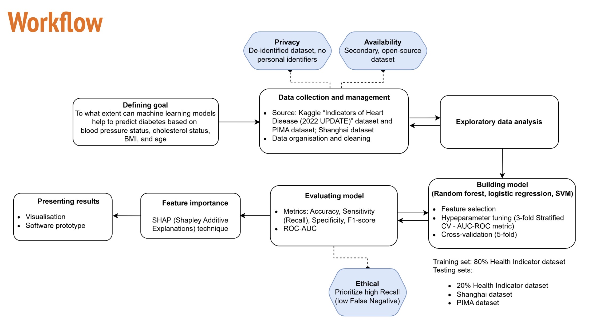
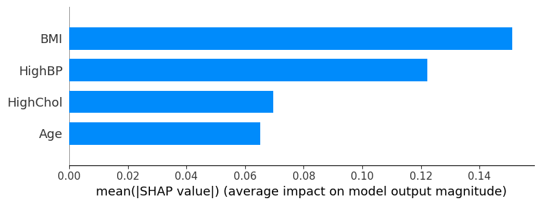
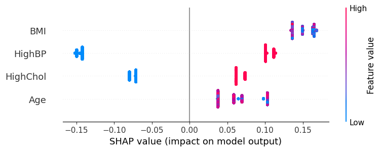
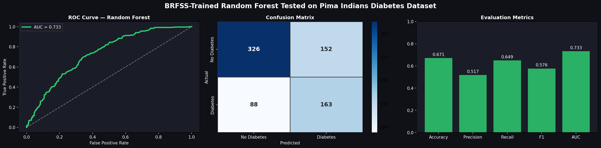
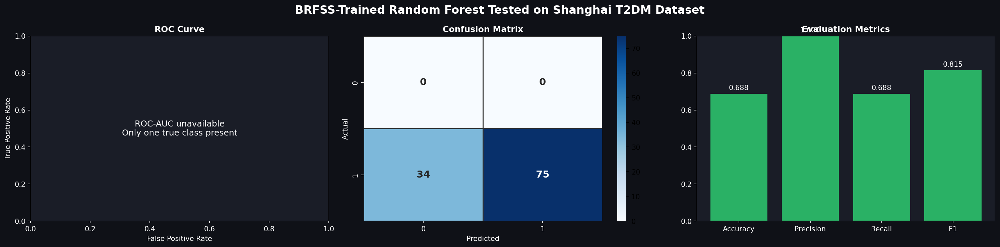

# Diabetes Risk Prediction with Machine Learning

A machine-learning project exploring how four accessible health indicators — **BMI, age, high blood pressure and high cholesterol** — can be used to predict Type 2 diabetes risk.

Completed for **BMET9925 / BMET2925 — AI, Data and Society in Health** at the University of Sydney, the project combines data cleaning, exploratory analysis, supervised classification, model evaluation, external-dataset testing and SHAP-based explainability.



## Research question

> How effectively can BMI, Age, High Cholesterol and High Blood Pressure status indicators predict T2DM, and which of these health variables are the strongest predictors of the disease?

## Workflow

1. **Data preparation** — inspect structure, missing values, duplicates and outliers.
2. **Exploratory data analysis** — examine class balance, feature distributions, diabetes prevalence and correlations.
3. **Baseline modelling** — compare Logistic Regression, Random Forest and SVM.
4. **Model evaluation** — assess accuracy, recall, specificity, F1 and ROC-AUC.
5. **Robustness testing** — use stratified cross-validation and external datasets.
6. **Explainability** — use SHAP to understand feature effects.
7. **Prototype direction** — the project plan proposed a Streamlit interface for real-time risk prediction and visualisation.

## Features

| Feature | Meaning |
|---|---|
| `BMI` | Body Mass Index |
| `Age` | BRFSS age-category code |
| `HighBP` | High blood pressure indicator |
| `HighChol` | High cholesterol indicator |

## Models

The project considered:

- Logistic Regression
- Random Forest
- Support Vector Machine (SVM)

The supplied trained artifacts include a tuned Random Forest and SVM. See [`models/MODEL_CARD.md`](models/MODEL_CARD.md).

## Results

### SHAP feature importance



The supplied SHAP analysis ranks **BMI** as the most influential of the four features, followed by **HighBP**, **HighChol** and **Age**.



### Pima external validation



The displayed external-test run reports ROC-AUC of approximately **0.733**. This is an exploratory portability test: Pima does not contain a cholesterol variable, so the historical analysis uses a placeholder for `HighChol`, while `HighBP` is derived from diastolic blood pressure.

### Shanghai external sensitivity test



The Shanghai cohort used here contains only confirmed T2DM cases. Because only one true class is represented, **ROC-AUC and specificity cannot be meaningfully calculated**. This result is best interpreted as a sensitivity-style test, not a full generalisation benchmark.

## Repository structure

```text
diabetes-risk-prediction-ml/
├── README.md
├── requirements.txt
├── data/
│   ├── README.md
│   └── raw/
├── docs/
│   └── workflow.jpeg
├── models/
│   ├── MODEL_CARD.md
│   ├── best_rf.pkl
│   └── final_svm.pkl
├── notebooks/
│   ├── 01_data_cleaning_eda_baseline.ipynb
│   └── 02_model_evaluation_external_validation_shap.ipynb
└── results/
    ├── pima_external_validation.png
    ├── shanghai_external_validation.png
    ├── shap_feature_importance.png
    └── shap_summary.png
```

## Setup

```bash
python -m venv .venv
source .venv/bin/activate
pip install -r requirements.txt
jupyter notebook
```

Place the datasets listed in [`data/README.md`](data/README.md) under `data/raw/`.

> The supplied pickle files were created using **scikit-learn 1.7.2**, so that version is pinned for compatibility.

## Reproducibility notes and limitations

This repository is a cleaned portfolio version of the supplied project materials. Important limitations are documented rather than hidden:

- The original fitted training preprocessor/scaler was **not supplied**. Some historical external-validation cells therefore fit a scaler on the external dataset itself. A stronger implementation would save the training preprocessor and reuse it unchanged.
- The 5-fold cross-validation cell in the supplied evaluation notebook uses a Random Forest configuration that differs from the supplied `best_rf.pkl`; it should be viewed as a separate robustness experiment.
- Pima lacks a cholesterol feature and its blood-pressure variable is not identical to the BRFSS indicator.
- The Shanghai cohort contains only positive T2DM cases, preventing full binary-classification evaluation.
- This is an **educational risk-prediction project**, not a clinically validated diagnostic system.

## Tech stack

`Python` · `pandas` · `NumPy` · `scikit-learn` · `Matplotlib` · `Seaborn` · `SHAP` · `Jupyter`

## Disclaimer

For educational and research demonstration purposes only. Do not use this project to diagnose diabetes or make clinical decisions.
